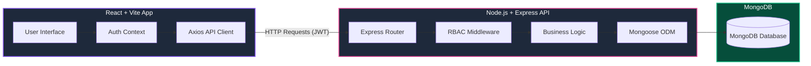
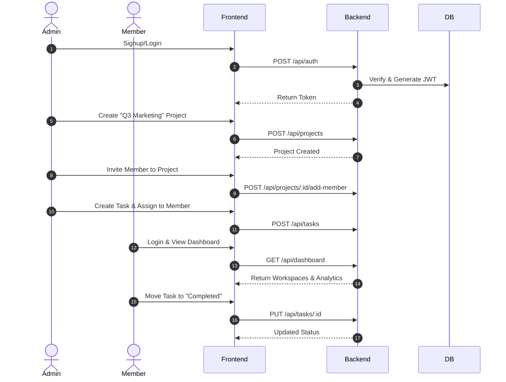

<div align="center">
  

  <h3>🚀 The Ultimate AI-Ready Team Collaboration Platform</h3>
  
  <p>
    A blazing-fast, visually stunning, and highly interactive Task Manager built for modern teams. Manage projects, assign tasks, and track real-time progress with a premium glassmorphic UI.
  </p>

  <p>
    
    
    
    
    
    
  </p>
</div>

---

## ✨ Key Features

*   🎨 **Premium Glassmorphic UI**: Dynamic backgrounds, interactive hover states, and smooth micro-animations.
*   🔐 **Role-Based Access Control (RBAC)**: Distinct privileges for `Admins` and `Members`.
*   📊 **Intelligent Dashboard**: Real-time analytics on total tasks, completion rates, and overdue items.
*   📋 **Kanban-Style Project Views**: Seamlessly track task progression from `Todo` ➡️ `In Progress` ➡️ `Completed`.
*   ⚡ **Zero-Config Local Setup**: Built-in `mongodb-memory-server` means it works instantly without installing databases locally!

---

## 🏗️ System Architecture



---

## 🛡️ Role-Based Access Control (RBAC)

Security is paramount. The system automatically restricts actions based on the authenticated user's role:

| Feature/Action | 👑 Admin | 👨‍💻 Member |
| :--- | :---: | :---: |
| **Create Workspaces** | ✅ | ❌ |
| **Invite Users to Workspace** | ✅ | ❌ |
| **Create Tasks** | ✅ | ✅ (In own workspaces) |
| **Assign Tasks to Others** | ✅ | ❌ |
| **Update Task Status** | ✅ | ✅ |
| **Delete Tasks** | ✅ | ❌ |
| **View Dashboard Analytics** | ✅ (Global) | ✅ (Personal) |

---

## 🔄 The User Journey



---

## 🚀 Quick Start Guide

Getting up and running is incredibly simple. Click the dropdowns below to expand the instructions:

<details>
<summary><b>🛠️ 1. Start the Backend Server (API)</b></summary>
<br>

Navigate to the backend folder and start the API. **Note:** You do *not* need MongoDB installed locally! The app uses an in-memory database automatically for development.

```bash
cd backend
npm install
npm run dev
```
*You will see a success message indicating the server and in-memory DB have started.*
</details>

<details>
<summary><b>🖥️ 2. Start the Frontend Application (UI)</b></summary>
<br>

Open a **new** terminal window, navigate to the frontend folder, and start Vite.

```bash
cd frontend
npm install
npm run dev
```
*Click the `localhost:5173` link in your terminal to view the app!*
</details>

---

## 🔌 API Reference

### Authentication
*   `POST /api/auth/signup` - Register a new user (`admin` or `member`)
*   `POST /api/auth/login` - Authenticate and receive JWT token

### Workspaces (Projects)
*   `GET /api/projects` - Get all workspaces for the logged-in user
*   `POST /api/projects` - Create a new workspace 👑
*   `GET /api/projects/:id` - Get details of a specific workspace
*   `POST /api/projects/:id/add-member` - Add a user to a workspace 👑

### Tasks
*   `GET /api/tasks?projectId=ID` - Get all tasks for a specific workspace
*   `POST /api/tasks` - Create a new task
*   `PUT /api/tasks/:id` - Update a task (status, description, assignment)
*   `DELETE /api/tasks/:id` - Delete a task 👑

### Analytics
*   `GET /api/dashboard` - Get task overview metrics (dynamically filtered by role)

---

## 🚢 Deployment to Railway

Ready to go live? This monorepo can be deployed seamlessly to [Railway.app](https://railway.app/).

1. Create a new Railway Project from this GitHub Repository.
2. Setup **Two Separate Services**:
   
   **Service 1: Backend API**
   *   **Root Directory**: `/backend`
   *   **Build Command**: `npm install`
   *   **Start Command**: `npm start`
   *   **Environment Variables**: 
       *   `DB_URI` = Your MongoDB Atlas Connection String
       *   `JWT_SECRET` = A strong secret key

   **Service 2: Frontend UI**
   *   **Root Directory**: `/frontend`
   *   **Build Command**: `npm install && npm run build`
   *   **Start Command**: `npm run preview -- --port $PORT --host 0.0.0.0`
   *   **Environment Variables**: 
       *   `VITE_API_URL` = The public URL of your Railway Backend Service

---
<div align="center">
  <i>Built with ❤️ using React, Node.js, and TailwindCSS</i>
</div>